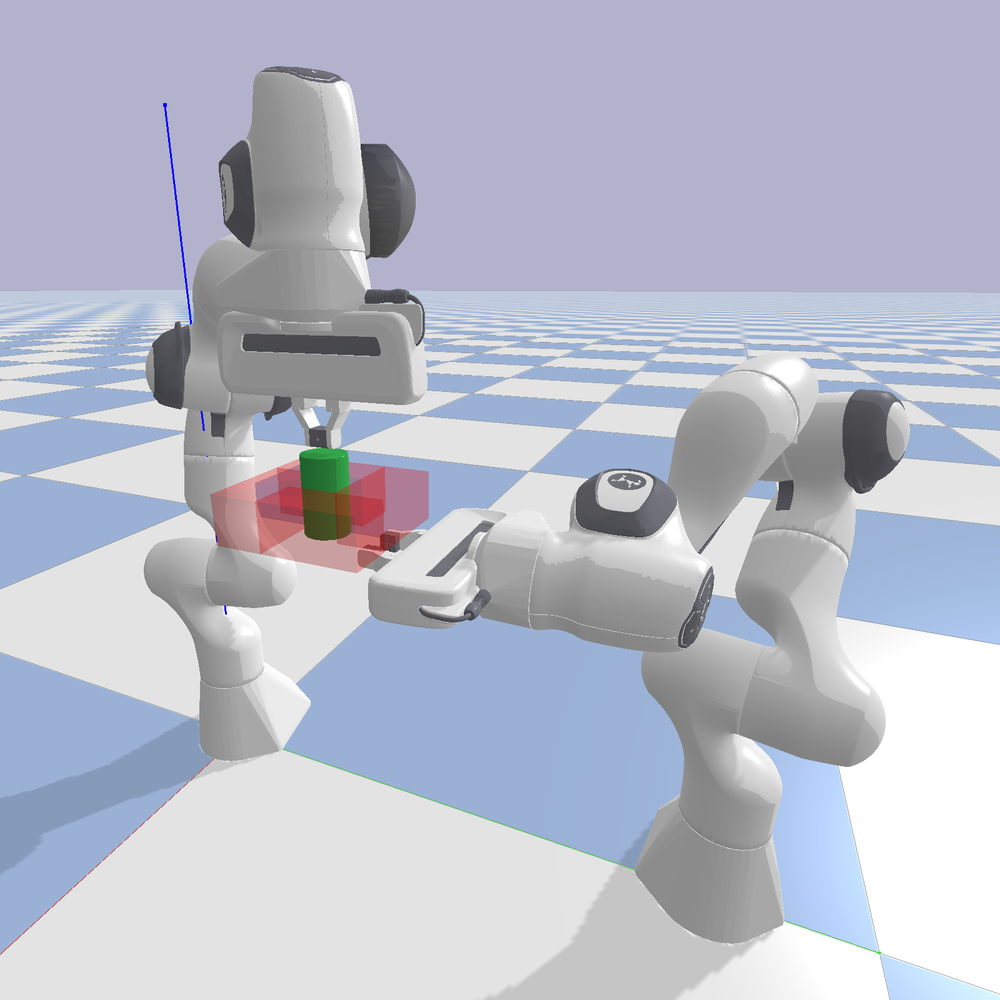
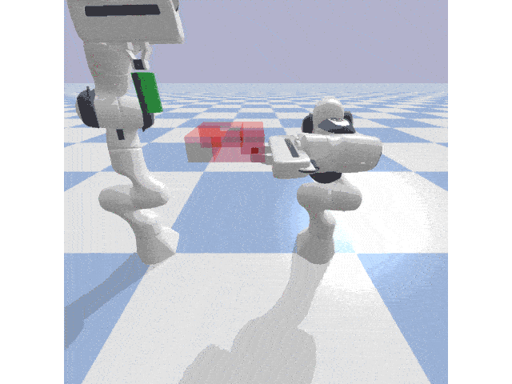
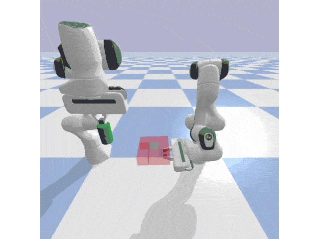

# consensus_normflow
Code implementation of consensus-based normalizing-flow policy for learning multi-agent coordination. See paper:

*Yin, H., Verginis, C. K., and Kragic, D. Consensus-based Normalizing-Flow Control: A Case Study in Learning Dual-Arm Coordination. 2022 IEEE/RSJ International Conference on Intelligent Robots and Systems (IROS). Kyoto, Japan.*

    

# Dependencies (Tested on)

pytorch==1.10.2

numpy==1.22.2

matplotlib==3.5.1

**For policy learning and gym environments**

[pybullet](https://github.com/bulletphysics/bullet3)

[garage](https://github.com/rlworkgroup/garage/tree/e395ba67ff00947b7fe2958481ce6e606d3e9d96)

Weights & Biases
